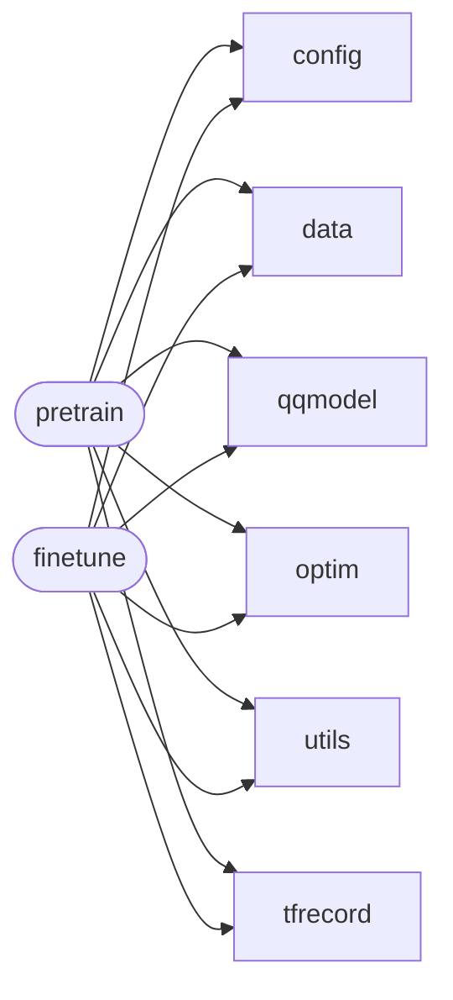

# Code Overview

[_Documentation generated by Documatic_](https://www.documatic.com)

<!---Documatic-section-Codebase Structure Python-start--->
## Codebase Structure Python

The codebase has a 2-deep folder structure,
                with 24 code files in total.

<!---Documatic-block-system_architecture-start--->

<!---Documatic-block-system_architecture-end--->

# #
<!---Documatic-section-Codebase Structure Python-end--->

<!---Documatic-section-Important Functions-start--->
## Important Functions

<!---Documatic-block-important_funcs-start--->
<!---Documatic-block-most_used_funcs-start--->
### Most Utilised Functions

* [job1.data.record_trans.record_transform](4-job1_data.md#job1.data.record_trans.record_transform) (2 times)
* [job1.optim.create_optimizer.create_optimizer](3-job1_optim.md#job1.optim.create_optimizer.create_optimizer) (2 times)
* [job1.utils.eval_spearman.evaluate_emb_spearman](5-job1_utils.md#job1.utils.eval_spearman.evaluate_emb_spearman) (2 times)
* [job1.utils.utils.set_random_seed](5-job1_utils.md#job1.utils.utils.set_random_seed) (2 times)
<!---Documatic-block-most_used_funcs-end--->
<!---Documatic-block-important_funcs-end--->

# #
<!---Documatic-section-Important Functions-end--->

<!---Documatic-section-File IO-start--->
## File IO

<!---Documatic-block-file_io-start--->
The following files have file read operations

<!---Documatic-block-job1-start--->

	
<code>job1</code> (Click to Expand!)

* job1.finetune
* job1.pretrain

<!---Documatic-block-job1-end--->

<!---Documatic-block-job1.data-start--->

	
<code>job1.data</code> (Click to Expand!)

* job1.data.record_trans

<!---Documatic-block-job1.data-end--->

<!---Documatic-block-job1.tfrecord-start--->

	
<code>job1.tfrecord</code> (Click to Expand!)

* job1.tfrecord.reader
* job1.tfrecord.tools.tfrecord2idx

<!---Documatic-block-job1.tfrecord-end--->

<!---Documatic-block-job1.utils-start--->

	
<code>job1.utils</code> (Click to Expand!)

* job1.utils.eval_spearman

<!---Documatic-block-job1.utils-end--->

The following files have file write operations

<!---Documatic-block-job1-start--->

	
<code>job1</code> (Click to Expand!)

* job1.finetune

<!---Documatic-block-job1-end--->

<!---Documatic-block-job1.tfrecord-start--->

	
<code>job1.tfrecord</code> (Click to Expand!)

* job1.tfrecord.tools.tfrecord2idx
* job1.tfrecord.writer

<!---Documatic-block-job1.tfrecord-end--->
<!---Documatic-block-file_io-end--->

# #
<!---Documatic-section-File IO-end--->

<!---Documatic-section-Class Hierarchy-start--->
## Class Hierarchy

<!---Documatic-block-BertPreTrainedModel-start--->

	
<code>BertPreTrainedModel</code> (Click to Expand!)

* job1.qqmodel.qq_uni_model.UniBert
* job1.qqmodel.qq_uni_model.UniBertForMaskedLM

<!---Documatic-block-BertPreTrainedModel-end--->

<!---Documatic-block-nn.Module-start--->

	
<code>nn.Module</code> (Click to Expand!)

* job1.qqmodel.qq_uni_model.QQUniModel
* job1.qqmodel.qq_uni_model.VisualLMPredictionHead
* job1.qqmodel.qq_uni_model.VisualOnlyMLMHead
* job1.qqmodel.qq_uni_model.VisualPredictionHeadTransform

<!---Documatic-block-nn.Module-end--->

<!---Documatic-block-torch.nn.Module-start--->

	
<code>torch.nn.Module</code> (Click to Expand!)

* job1.qqmodel.nextvlad.NeXtVLAD

<!---Documatic-block-torch.nn.Module-end--->

<!---Documatic-block-torch.utils.data.Dataset-start--->

	
<code>torch.utils.data.Dataset</code> (Click to Expand!)

* job1.data.qq_dataset.QQDataset

<!---Documatic-block-torch.utils.data.Dataset-end--->

<!---Documatic-block-torch.utils.data.IterableDataset-start--->

	
<code>torch.utils.data.IterableDataset</code> (Click to Expand!)

* job1.tfrecord.torch.dataset.MultiTFRecordDataset
* job1.tfrecord.torch.dataset.TFRecordDataset

<!---Documatic-block-torch.utils.data.IterableDataset-end--->

# #
<!---Documatic-section-Class Hierarchy-end--->

[_Documentation generated by Documatic_](https://www.documatic.com)